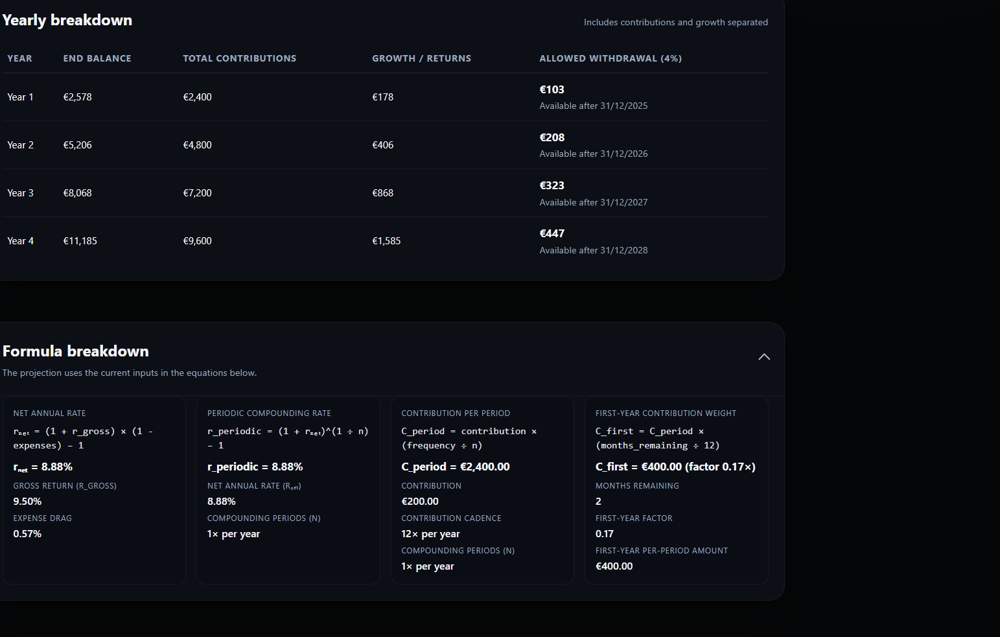

# Dynamic Compound Interest Desktop App

Freedom24 + VUAA compound-interest dashboard built with React, TypeScript, Vite, and Electron.

## Screenshots




## Prerequisites

- Node.js **20.19.0+** or **22.12.0+** (Vite 7 hard requirement). Using 20.16.x will trigger `Vite requires Node.js version 20.19+ or 22.12+` during `npm run build` / `npm run package`.
- npm 10+ (ships with Node 20+).

This repo ships with `app/.nvmrc`, so if you use nvm (macOS/Linux) or nvm-windows you can run:

```bash
nvm install 20.19.0
nvm use 20.19.0
```

If you are not using nvm, download the matching installer from [nodejs.org](https://nodejs.org/en/download) before building or packaging.

## Getting Started

Install dependencies once the correct Node version is active:

```bash
npm install
```

Start the renderer + Electron dev environment:

```bash
npm run dev
```

Useful scripts:

- `npm run lint` - ESLint over the whole project.
- `npm run test` - Vitest suite (runs headless).
- `npm run build` - Type-check and create a production Vite build under `dist/`.
- `npm run package` - Builds the renderer and packages the Electron app via `electron-builder`.

## Packaging Tips

- Run `npm run package` only after verifying your Node version with `node -v`.
- Electron Builder warns when `author`/manufacturer metadata is missing. Add an `author` field to `package.json` to brand MSI artifacts.

## Installing packaged builds

Artifacts generated in `dist/` can be distributed directly to end users:

- **Windows**: share the `.exe` or `.msi`. Running it installs the app under `%LocalAppData%/Programs` and adds Start Menu shortcuts. SmartScreen may warn until the binaries are codesigned.
- **macOS**: distribute the `.dmg`. Users drag the app into `/Applications` and may need to allow the first run via *System Settings → Privacy & Security* if Gatekeeper flags the unsigned build.
- **Linux**: send the `.AppImage`. Recipients must `chmod +x` the file and run it (`./Dynamic\ Compound\ Interest-<version>.AppImage`); AppImageLauncher can integrate it with the desktop. Ubuntu users on older releases might need `sudo apt install libfuse2`.

For a user-facing walkthrough (including screenshots), point folks to `../docs/installation.md`.

## Troubleshooting

| Symptom | Fix |
| --- | --- |
| `Vite requires Node.js version 20.19+ or 22.12+` | Activate the version in `.nvmrc` with nvm/nvm-windows or install Node 20.19.0 manually, then rerun `npm install` and `npm run package`. |
| Native module rebuild issues | Delete `node_modules`, ensure the correct Node version is active, and run `npm install` before packaging. |

For additional details on the Electron/Vite toolchain, see the scripts defined in `package.json`.
